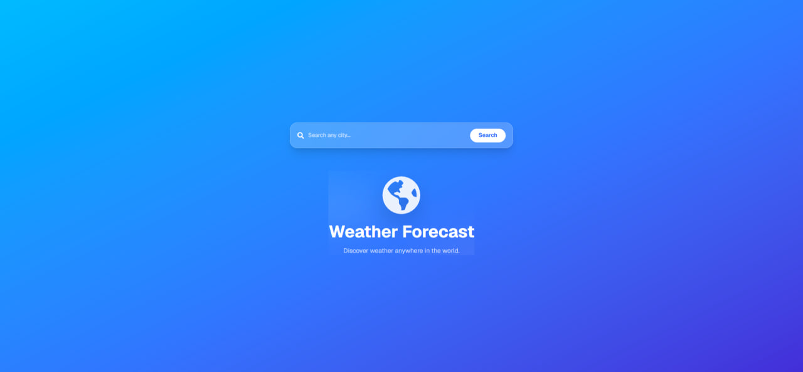

# 🌤️ Weather Forecast App

A modern and responsive weather application built with **React** and **Tailwind CSS**. Search for any city in the world and get real-time weather information with a clean glassmorphism UI.

---

## 📸 Screenshot

> Add your screenshot here

```md

```

> Replace `screenshot.png` with your actual screenshot file name.

---

## ✨ Features

- 🔍 Search weather by city name
- 🌡️ Current temperature
- ☁️ Weather condition with dynamic icons
- 📅 3-day weather forecast
- 💧 Humidity
- 💨 Wind speed
- 🌡️ Feels like temperature
- 👀 Visibility
- 🌅 Sunrise & Sunset time
- ⏰ Local date & time
- 🌍 Welcome screen
- 📱 Fully responsive design
- ⚡ Loading state
- ❌ Error handling

---

## 🛠️ Built With

- React
- Vite
- Tailwind CSS
- Framer Motion
- React Icons
- Lucide React
- WeatherAPI

---

## 🌐 API

This project uses the **WeatherAPI** to fetch real-time weather data.

https://www.weatherapi.com/

---

## 📱 Responsive

- Desktop
- Tablet
- Mobile

---

## 💡 Future Improvements

- 7-Day Forecast
- Hourly Forecast
- Air Quality Index
- UV Index
- Favorite Cities
- Dark / Light Mode
- Geolocation Support

---

## 👨‍💻 Author

**Sardorbek**

GitHub:
https://github.com/your-username

---

## ⭐ Show your support

If you like this project, consider giving it a ⭐ on GitHub!